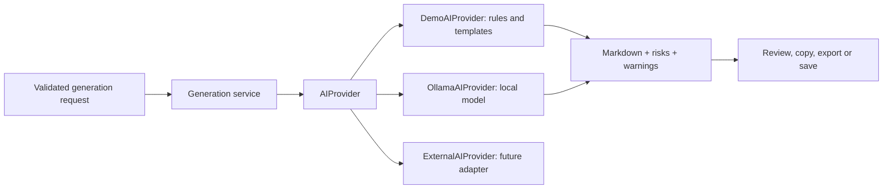
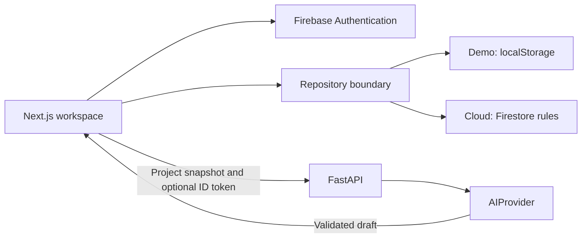
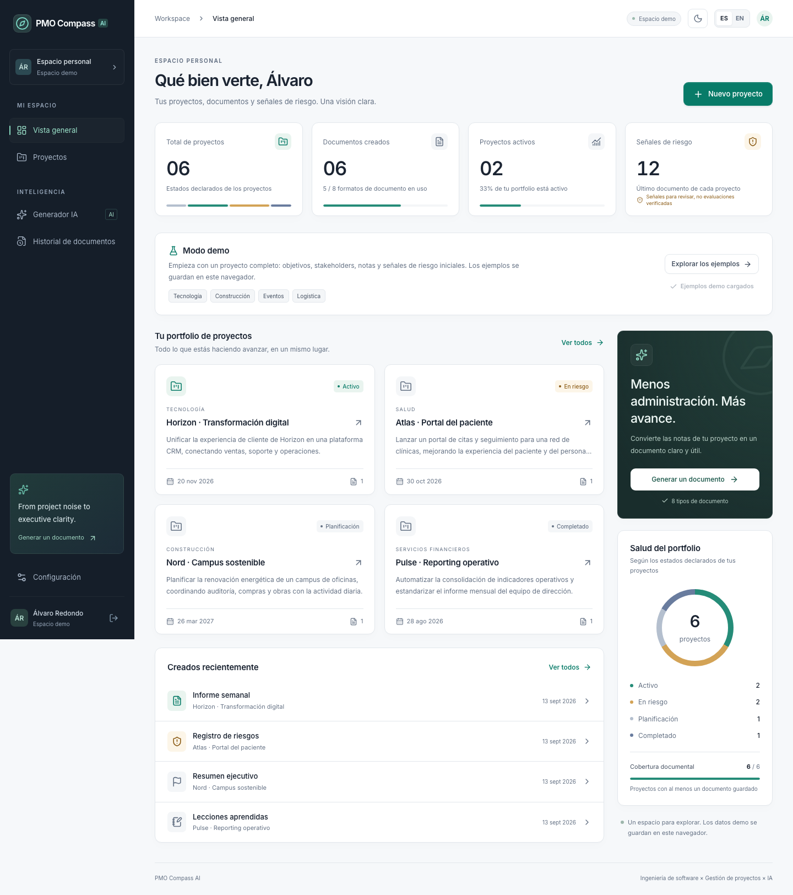

<div align="center">

# PMO Compass AI

**From project noise to executive clarity.**

A bilingual workspace that turns project context into structured, reviewable PMO documentation.

**Release candidate for a professional portfolio · Free template demo by default**

**Next.js · TypeScript · FastAPI · Firebase · Ollama**

Designed and built by **Álvaro Redondo Muñoz**

[Run locally](#local-installation) · [Try the workflow](#demo-workflow) · [Architecture](docs/architecture.md) · [Screenshots](#screenshots) · [Release checklist](docs/release-checklist.md)

</div>


## Problem it solves

Project managers work with meeting notes, delivery updates, risks and stakeholder requests spread across different places. Turning that information into an executive update means repeatedly reconstructing the project context.

PMO Compass AI brings the project, its notes and its documentation into one workspace. Choose a document, add the context that matters and review a structured draft before saving or sharing it. The product supports the PM's judgment: suggested risks and actions remain proposals for review.

## Main features

- A responsive SaaS landing with a visible source-to-report example and a professional portfolio section.
- A dashboard with project totals, document counts, status distribution, risk signals and documentation coverage calculated from saved data.
- Project creation, editing, notes and deletion, with sector, objectives, stakeholders, dates and an optional EUR budget.
- Eight document formats, independent English/Spanish document language and additional context.
- Markdown preview, source-note review, explicit save, clipboard copy and `.md` download.
- Document history with project/type filters, content search and saved-document detail.
- English and Spanish UX, persistent light/dark/system themes, sidebar navigation, loading, error and empty states.
- A no-account demo with six fictional projects and safe loading of missing examples.
- Optional Firebase email/password accounts, user profiles and owner-scoped Firestore data.
- Interchangeable generation providers, clear failure states and explicit Ollama-to-demo fallback.

| Module | Output |
| --- | --- |
| Executive Brief Generator | Project purpose, objectives, dependencies and sponsor questions |
| Weekly Status Reports | Reported progress, concerns, decisions and next steps |
| Risk Radar | Source evidence, proposed assessments, mitigations and owners |
| Meeting Notes Transformer | Topics, recorded versus pending decisions and follow-up actions |
| Action Plan Builder | Actions, explicit owners/date references and closure criteria |
| Stakeholder Email Generator | A reviewable subject and email draft; no email is sent |
| Scope Change Analyzer | Baseline, requested change, impact dimensions and approval questions |
| Lessons Learned Generator | Observations, possible causes and proposed improvements |

## Demo mode

Choose **Try the demo** on the landing or login page. No account, API key or downloaded model is required. The first visit loads six projects and six example documents in the interface language:

| Project | Sector | Context to explore |
| --- | --- | --- |
| Horizon · Digital transformation | Technology | CRM rollout, approved pilot, vendor approval and support training |
| Nord · Sustainable campus | Construction | Energy audit, procurement delay and building access |
| Summit · Product leadership forum | Event | Venue, speakers, staffing capacity and a live-streaming scope request |
| Relay · Regional distribution launch | Logistics | Carrier delay, barcode defects and weekend delivery scope |
| Atlas · Patient portal | Healthcare | Integration delay, booking defects and SMS reminders |
| Pulse · Operational reporting | Financial services | Completed handover, metric definitions and lessons learned |

Every project includes a description, objectives, stakeholders and detailed notes. Initial risk signals for the four featured sectors are recorded in the notes and carried into generated documents; there is no separate risk lifecycle database. All organisations, people and delivery figures are fictional.

**Demo storage and AI provider are separate choices.** Demo projects stay in localStorage in this browser. With the default `AI_PROVIDER=demo`, the backend uses deterministic rules and templates, not a live language model. With a local Ollama configuration, the same demo workspace can exercise the local model. On a Firebase deployment, the public demo always uses the template endpoint.

### Load or rebuild examples

- **First visit:** `/demo` seeds the local workspace automatically.
- **Returning visitor:** Overview → Demo Mode → **Load missing examples** adds missing project IDs and their example documents. Existing projects, edited notes, saved documents and custom work are preserved. This also adds Event and Logistics examples to an older four-project demo.
- **Fresh recording:** Settings → Data & storage → **Reset demo data** replaces the entire local demo after confirmation. Use a fresh browser context if you want to keep your local demo edits.
- **Maintainer utility:** `npm run seed:demo` rebuilds the checked-in bilingual document fixtures using `DemoAIProvider`. It writes only `frontend/src/lib/demo-documents.json`; it does not connect to Firebase, call an AI service or modify any visitor's browser.

Loading and resetting are guarded against Firebase users at the repository boundary. Real accounts start empty. Entering the demo from a cloud dashboard switches to a separate local workspace; log in again to return to the cloud account. Changing the interface language does not translate stored projects. Fresh examples use the language selected when they are loaded.

## AI Provider architecture



| Provider | Current behavior | Dependency |
| --- | --- | --- |
| `demo` — default | Eight document-specific PMO templates, source-aware extraction and ES/EN narrative | No AI service, credentials or model |
| `ollama` | Local `/api/chat` request with schema-guided output, bounded timeout and validation | A separately installed Ollama model |
| `external` | Typed extension point returning `501 external_not_configured` | No SDK, credential lookup or paid call implemented |

Demo templates distinguish reported work from future actions, preserve explicit owners/date references and identify risk evidence. Missing facts become questions or preparation steps. Source quotes keep their original language. Rule matching can miss or misclassify signals; generated drafts require review.

If Ollama fails, the UI explains the error and offers **Continue with demo templates**. The fallback is a separate user action. It keeps the input and records the actual `demo` provider and a persistent warning; it does not change storage mode. The health endpoint checks API readiness and configuration, not model availability.

See [AI strategy](docs/ai-strategy.md) for prompts, validation, Ollama configuration and the future external-provider contract.

## Tech stack

| Layer | Technology | Responsibility |
| --- | --- | --- |
| Frontend | Next.js 16 App Router, React 19, TypeScript | Routing, typed interactive workspace and forms |
| UI | Tailwind CSS 4, semantic CSS tokens, Lucide, Inter | Responsive layouts and consistent light/dark surfaces |
| Documents | React Markdown, remark-gfm | Tables, readable reports and safe Markdown rendering |
| Backend | Python, FastAPI, Pydantic, HTTPX | Validated API, authentication and provider adapters |
| Identity and cloud data | Firebase Authentication, Cloud Firestore | Accounts, profiles and private project/document storage |
| Local generation | Demo templates; optional Ollama | No mandatory paid AI API |
| Verification | pytest, Playwright, axe, Firebase emulators | Contracts, user journeys, accessibility and ownership |
| Tooling | npm workspaces, ESLint, Prettier, GitHub Actions | Repeatable setup and CI configuration |

The JavaScript dependency tree is locked in `package-lock.json`. Python direct dependencies are pinned in the requirements files; transitive Python packages are resolved during installation and are not yet fully locked.

## Architecture overview



The frontend owns interaction and persistence through a repository. FastAPI is stateless with respect to project content: it generates a draft but never saves it. Firebase tokens protect private generation; Firestore rules protect stored records independently of the UI. The user explicitly saves a generated draft.

```text
frontend/src/
  app/              Landing, login, demo and workspace routes
  components/       Shell, forms, documents, demo guide and providers
  lib/              Repository, API, Firebase and bilingual demo fixtures
  locales/          Typed English and Spanish dictionaries
  styles/           Semantic tokens, workspace and marketing styles
  types/            Domain contracts
backend/
  app/api/          Routes, ID-token verification and rate limits
  app/models/       Pydantic request and output contracts
  app/providers/    Templates, prompts, adapters, factory and service
  tests/            API and provider tests
firebase/           Firestore rules, indexes and emulator tests
e2e/                Demo, provider-fallback and Firebase browser journeys
scripts/            Setup, development, seeding, audits and screenshots
docs/               Technical documentation, demo script and screenshots
.github/workflows/  CI configuration
```

See [architecture and flows](docs/architecture.md) for boundaries, authentication, generation, deletion and scaling constraints.

## Database schema summary

| Collection | Purpose | Key fields |
| --- | --- | --- |
| `users/{uid}` | Account profile | `uid`, `name`, `email`, `preferredLanguage`, `createdAt` |
| `projects/{id}` | Owned project and source context | `ownerId`, `name`, `sector`, `description`, `objectives`, dates, `status`, `budget`, `stakeholders`, `notes`, timestamps, optional `deleting` |
| `documents/{id}` | Immutable saved draft | `ownerId`, `projectId`, `type`, `language`, `inputContext`, `generatedContent`, `provider`, `risks`, `warnings`, `createdAt` |

One user owns many projects; one project has many documents. Dates use `YYYY-MM-DD`; creation/update timestamps are ISO UTC strings. IDs live in Firestore paths and are added to frontend objects on read. Queries and rules enforce ownership and parent ownership. [Full schema and invariants](docs/database-schema.md).

## Local installation

Recommended: **Node.js 22 LTS** (see `.nvmrc`), **npm 10+**, **Python 3.11–3.13**. Node 20.19+ remains the historical compatibility minimum, but use a supported LTS release for deployment. Java 21 is needed only for Firebase emulator tests. The project has been exercised on macOS with Node 20.19.5 and Python 3.13.1.

From the repository root:

```bash
npm run setup
npm run dev
```

`setup` installs dependencies, creates `backend/.venv` and copies the frontend/backend environment examples only if the target files do not exist. Existing configuration is preserved.

Open [localhost:3000](http://localhost:3000) and choose **Try the demo**. API documentation is at [localhost:8000/docs](http://localhost:8000/docs). `npm run dev` starts both services on loopback; Ctrl+C stops them.

## Environment variables

The root `.env.example` is a reference. The running applications read these two files:

**`frontend/.env.local`** — copied from [frontend/.env.example](frontend/.env.example):

```dotenv
NEXT_PUBLIC_DATA_MODE=demo
NEXT_PUBLIC_API_URL=http://localhost:8000
NEXT_PUBLIC_USE_FIREBASE_EMULATORS=false
```

**`backend/.env`** — copied from [backend/.env.example](backend/.env.example):

```dotenv
AI_PROVIDER=demo
AUTH_MODE=demo
APP_ENV=development
CORS_ORIGINS=["http://localhost:3000","http://127.0.0.1:3000"]
OLLAMA_BASE_URL=http://localhost:11434
OLLAMA_MODEL=llama3.1
OLLAMA_TIMEOUT_SECONDS=120
FIREBASE_PROJECT_ID=
RATE_LIMIT_PER_MINUTE=30
```

`AI_PROVIDER` selects generation; `AUTH_MODE` selects private endpoint authentication. `OLLAMA_TIMEOUT_SECONDS` must be greater than zero and at most 300. Restart the backend after changing its configuration and restart/rebuild Next.js after changing public variables. Keep `.env` files and server credentials out of GitHub; templates contain no credentials.

Only `.env.example` templates belong in the published repository. Setup-generated `backend/.env` and `frontend/.env.local` stay on the developer's machine and are excluded by Git. `npm run check:release` verifies that exclusion along with the default demo settings.

### Optional local Ollama

With Ollama installed, download a compatible model and start the service if it is not already running:

```bash
ollama pull llama3.1
ollama serve
```

Set `AI_PROVIDER=ollama` in `backend/.env`, keep the base URL and model above, then restart the backend. Neither application startup nor the default demo requires Ollama. No model is downloaded automatically. See [failure handling and setup](docs/ai-strategy.md#ollamaaiprovider).

### Optional Firebase accounts

1. Create a Firebase project and web app; enable Email/Password sign-in and authorise your app domain.
2. Create Cloud Firestore and configure the browser environment:

```dotenv
NEXT_PUBLIC_DATA_MODE=firebase
NEXT_PUBLIC_API_URL=http://localhost:8000
NEXT_PUBLIC_FIREBASE_API_KEY=your-public-web-api-key
NEXT_PUBLIC_FIREBASE_AUTH_DOMAIN=your-project.firebaseapp.com
NEXT_PUBLIC_FIREBASE_PROJECT_ID=your-project
NEXT_PUBLIC_FIREBASE_APP_ID=your-public-web-app-id
NEXT_PUBLIC_USE_FIREBASE_EMULATORS=false
```

3. Set `AUTH_MODE=firebase` and the same `FIREBASE_PROJECT_ID` in `backend/.env`. Provide Application Default Credentials or `GOOGLE_APPLICATION_CREDENTIALS=/absolute/path/outside/repository/service-account.json` for server-side token verification. The backend checks token revocation. Browser Firebase configuration is public; service-account credentials are server-only.
4. Review and deploy the supplied rules and indexes to your own project:

```bash
npx firebase login
npx firebase deploy --only firestore:rules,firestore:indexes --project YOUR_PROJECT_ID
```

5. Restart both services and create an account from the login page. Accounts start empty; demo projects are never inserted into Firestore.

For a public deployment, configure HTTPS, your domain's CORS origins and `APP_ENV=production`. Production startup requires `AUTH_MODE=firebase` and rejects Firebase emulator environment variables. The frontend production build also rejects an enabled emulator flag. This repository does not deploy a site automatically. Follow the [deployment guide](docs/deployment.md).

## How to run frontend

```bash
npm run dev --workspace frontend
```

For an optimised frontend build:

```bash
npm run build
npm start
```

The production commands above build and start the frontend only. Run the backend separately.

## How to run backend

```bash
cd backend
.venv/bin/python -m uvicorn app.main:app --reload --host 127.0.0.1 --port 8000
```

On Windows, use `.venv\Scripts\python.exe`; the setup, combined development, API-test and seed scripts detect the platform. Omit `--reload` for a production process.

| API endpoint | Behavior |
| --- | --- |
| `GET /api/v1/health` | API status, configured provider and model; no model probe |
| `POST /api/v1/generate` | Configured provider; Firebase ID token required when enabled |
| `POST /api/v1/demo/generate` | Public, deterministic templates regardless of private provider |

Requests contain `project`, `type`, `language`, `inputContext` and optional `useDemoFallback`. Responses contain a draft ID, timestamp, actual provider, Markdown, risks and warnings. No document is saved by the API. Explore exact schemas and stable error responses in `/docs` and [AI strategy](docs/ai-strategy.md).

## How to run tests

```bash
npm run check                  # ESLint, TypeScript, API/provider tests, production build
npm run format:check           # Source and browser-test formatting
npm run check:release          # Relative documentation links, publishable files and safe defaults
npm run test:release           # Regression tests for publication checks
npx playwright install chromium
npm run test:e2e               # Local demo workflows and responsive UI
npm run test:providers         # Ollama connection failure and explicit fallback
npm run test:rules             # Firestore rules; requires Java 21
npm run test:firebase          # SDK login, persistence and account isolation in emulators
```

Run the two Firebase commands sequentially: they share the Firestore emulator. They target only the fictitious `demo-pmo-compass` project. Ports: frontend/API `3001/8001`, Auth `9099`, Firestore `8085`. Provider fallback tests use an isolated API on `8002` and an intentionally closed local Ollama port.

With `npm run dev` active:

```bash
npm run test:a11y              # Light/dark axe scans over nine routes
npm run screenshots            # Actual browser captures for this README
```

GitHub Actions is configured to run quality checks, build, browser tests and emulators. [Validation record](docs/VALIDATION.md) documents results and their scope. Chromium and local Firebase emulators are tested; live cloud deployment, live Ollama inference and other browser engines are separate verification steps.

## Demo workflow

1. Open the landing, select EN or ES, then **Log in → Try the demo**. Firebase sign-in is optional and is visibly unavailable when not configured.
2. Explore the dashboard and choose Horizon, Nord, Summit or Relay from Projects.
3. Review the saved notes, then open AI Generator and choose **Weekly Status Report**.
4. Set the document language and add: “Prepare the sponsor review. Highlight blockers, decisions needed and the next accountable actions.”
5. Generate and review the formatted report. Copy, save or download Markdown.
6. Choose **Risk Register**, generate again and inspect source evidence, proposed mitigation and suggested owners.
7. Save and reopen from Document history to demonstrate persistence.

The [60–90 second recording script](docs/demo-script.md) includes a short project-creation example, timings and an English voiceover.

## Screenshots

These images are captured from the actual app using fictional data. Refresh them with `npm run screenshots` before publishing.

| Capture | What it demonstrates |
| --- | --- |
| [Product hero](docs/screenshots/landing-hero-en.png) | Value proposition and visible document preview |
| [Full landing](docs/screenshots/landing-en.png) / [dark](docs/screenshots/landing-dark-en.png) | Modules, portfolio section and theme consistency |
| [Dashboard](docs/screenshots/dashboard-es.png) / [dark](docs/screenshots/dashboard-dark-es.png) | Metrics, demo guide, portfolio and recent documents |
| [Risk generation](docs/screenshots/generator-risk-register.png) / [dark](docs/screenshots/generator-dark-risk-register.png) | Source context, provider label and generated content |
| [Mobile landing](docs/screenshots/landing-mobile.png) | Responsive public experience |
| [Mobile dashboard](docs/screenshots/dashboard-mobile.png) / [generator](docs/screenshots/generator-mobile.png) | Usable private workspace on a phone |



Publication placeholders — fill these when preparing your own GitHub/LinkedIn presentation:

- **[LIVE DEMO LINK]** — add the deployed URL after deployment is verified.
- **[60–90 SECOND VIDEO]** — add your recording using the demo script.
- **[AUTHENTICATED CLOUD SCREENSHOT]** — add a capture after configuring your own Firebase environment, with personal data excluded.

## Portfolio value

| Capability | Evidence in the project |
| --- | --- |
| Full-stack application architecture | Separate UI, repository, REST service and domain contracts |
| Authentication and user-specific data | Firebase Auth, owner-scoped queries, rules and two-account tests |
| Generative AI workflow design | Context capture → generation → human review → explicit persistence |
| AI provider abstraction | Common typed contract, configurable adapters and fallback provenance |
| PMO document generation | Eight distinct formats with source context and review criteria |
| Bilingual UX | Typed ES/EN dictionaries and independent document language |
| Clean technical documentation | Setup, architecture, schema, AI strategy, demo script and validation |
| Scalable product thinking | Explicit MVP boundaries and a phased roadmap with acceptance criteria |

## What I learned

- How to separate identity, persistence and generation so each can evolve independently.
- Why an AI feature needs output contracts, source evidence, useful failure states and human review as much as a prompt.
- How deterministic templates make the complete product demonstrable without an AI subscription.
- How Firebase rules and emulator tests enforce boundaries that a navigation guard alone cannot protect.
- How explicit saving and provider provenance keep a generated draft understandable after it is reopened.
- How bilingual microcopy, responsive layouts, accessible states and reproducible tests contribute to a credible software product.

## Why I built this

I built PMO Compass AI to connect software engineering with a practical project-management problem: turning scattered operational information into clear stakeholder communication. I wanted a working full-stack product that could demonstrate the complete workflow, from source notes to a saved report, while leaving room for better models and deeper PMO capabilities.

This is a professional portfolio project, with fictional examples and documented limitations. It does not claim real client outcomes or measured productivity gains.

## Roadmap

| Phase | Direction | Status |
| --- | --- | --- |
| Phase 1 — MVP | Bilingual workspace, demo, Firebase, eight formats, provider layer and tests | Implemented; deployment/model validation remain environment-specific |
| Phase 2 — Smarter PMO AI | Evaluations, document-specific inputs, risk lifecycle and improved generation | Planned |
| Phase 3 — Integrations | Optional tool connections, exports, teams and operational reliability | Planned |
| Phase 4 — Advanced AI | Authorised retrieval, citations and reviewable cross-project assistance | Planned |

See [product roadmap](docs/product-roadmap.md) for priorities and acceptance criteria. Current limits include whole-workspace loads, client-side filtering, process-local rate limits, localStorage device scope and no collaborative editing. Email sending, PDF/DOCX, password recovery, RAG and external AI calls are not implemented.

## LinkedIn post idea

> I built PMO Compass AI — from project noise to executive clarity.
>
> Project managers regularly turn meeting notes, delivery updates and stakeholder requests into reports. I wanted to explore how a focused software product could make that workflow clearer.
>
> PMO Compass AI brings project context and eight PMO document formats into a bilingual workspace: executive briefs, status reports, risk registers, meeting minutes, action plans, stakeholder emails, scope-change analysis and lessons learned.
>
> I built it with Next.js, TypeScript, FastAPI and Firebase. A shared AIProvider contract supports a deterministic demo, optional local Ollama generation and a future external-provider adapter. The demo requires no paid AI API.
>
> The most useful learning was designing the full workflow around generation: validated inputs, source evidence, human review, clear provider failures and user-specific persistence. I also tested authentication and data isolation with Firebase emulators and complete browser journeys.
>
> This is a professional portfolio project connecting Software Engineering, AI and Project Management. The demo uses fictional data, and the roadmap documents the next steps.
>
> [Add repository link and demo recording here]
>
> #SoftwareEngineering #GenerativeAI #ProjectManagement #NextJS #FastAPI #Firebase

The [LinkedIn publication guide](docs/linkedin-publication.md) includes final English/Spanish posts, short versions, video captions, screenshots and a 60–90 second storyboard. The [publication kit](docs/publication-kit.md) is the presentation index, and the [technical audit](docs/final-audit.md) records findings, fixes and remaining limits.

## Release and publication

This candidate preserves the current feature set. Demo templates remain the default; Ollama is optional and a future external adapter is not required to run the app. Local validation is recorded separately from repository publication, video recording and live deployment.

| Resource | Purpose |
| --- | --- |
| [Release checklist](docs/release-checklist.md) | Completed checks, known limits and remaining publication steps |
| [GitHub setup](docs/github-setup.md) | Public repository details, first commit, push and candidate-tag commands |
| [Deployment guide](docs/deployment.md) | Next.js, FastAPI and Firebase configuration for a hosted demo |
| [Demo script](docs/demo-script.md) | Prepared project input and an 85-second recording workflow |
| [LinkedIn publication](docs/linkedin-publication.md) | Copy-ready posts in both languages and presentation assets |
| [Architecture](docs/architecture.md) | Boundaries, identity, persistence and generation flows |

Publication targets **i22remua/pmo-compass-ai**. Local Git preparation does not publish the project: creating the empty GitHub repository and pushing require the owner's action. Video and live-demo links should be added only after those artifacts exist. Licence choice, recording and deployment remain manual release steps. No release tag or GitHub pre-release has been created by these local checks.

## Troubleshooting

| Symptom | Check |
| --- | --- |
| AI service unavailable | Start FastAPI, open `/api/v1/health` and verify `NEXT_PUBLIC_API_URL` |
| Sign-in unavailable | Set Firebase data mode and all four public Firebase values; restart Next.js |
| Permission denied | Verify the account, project ID and deployed rules; cloud errors never silently switch storage |
| Generation returns 401 | Match frontend/backend Firebase projects and configure server token credentials |
| Ollama unavailable | Check the running service, `ollama list`, base URL and configured model; use explicit demo fallback |
| Port in use | Change ports together with API URL/CORS; the emulator uses 8085 |
| Demo storage error | Allow browser storage or free space; a confirmed reset replaces local demo data |
| Clipboard unavailable | Use HTTPS or localhost; Markdown download remains available |

Additional documentation: [Architecture](docs/architecture.md) · [AI strategy](docs/ai-strategy.md) · [Database schema](docs/database-schema.md) · [Roadmap](docs/product-roadmap.md) · [Demo script](docs/demo-script.md).
