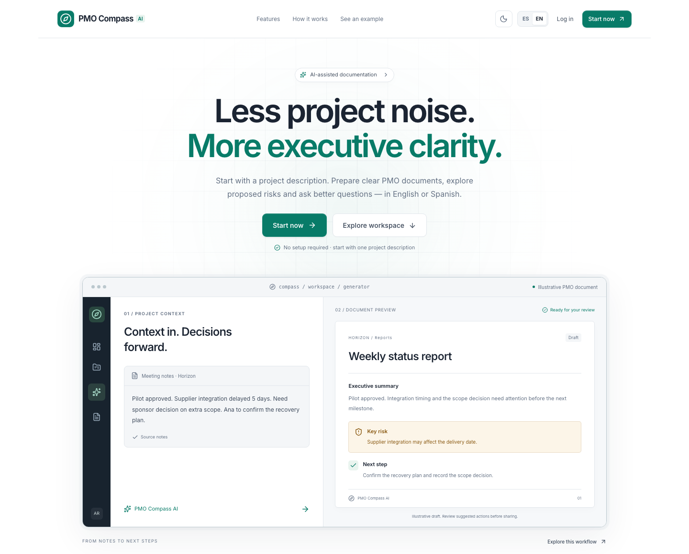
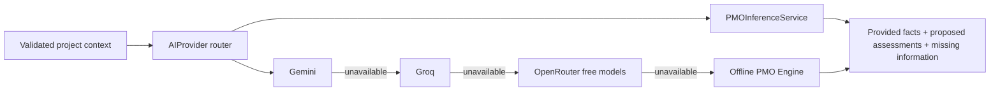

# PMO Compass AI

**AI-powered PMO workspace — from project context to reviewable decisions and documents.**

Built by **Álvaro Redondo Muñoz** · Español / English

- **Live App:** https://pmo-compass-ai.vercel.app
- **Repository:** https://github.com/i22remua/pmo-compass-ai
- **Public status:** live public workspace on Vercel. Public project creation, Gemini generation, offline fallback and Firebase cloud login are available. Real account persistence and cross-account isolation have been verified.
- **Backend API:** [Interactive documentation](https://pmo-compass-ai-api.vercel.app/docs) · [Service health](https://pmo-compass-ai-api.vercel.app/api/v1/health)

[](https://github.com/i22remua/pmo-compass-ai/actions/workflows/ci.yml)

[](https://pmo-compass-ai.vercel.app)

## Try the workspace online

For a quick first visit, choose **See a case in 2 minutes / Ver un caso en 2 minutos**: [open the public case](https://pmo-compass-ai.vercel.app/case-study). Compare fictional source notes with a clearly labelled pre-generated risk register, then optionally generate any of the eight formats, copy or export it. The example does not create an account, switch a session or save data. [My contribution](https://pmo-compass-ai.vercel.app/about#built) explains the problem, engineering decisions and verification.

To work with your own context, choose **Create my project / Crear mi proyecto**. Start with a description; expand additional details when needed. Optional Starter Projects add six fictional examples without overwriting your work. No installation, account or API key is needed by visitors.

The Starter Workspace saves projects and documents in this browser. Sign in or create an account for a separate private Firebase workspace and persistence across devices. Local drafts are not automatically transferred into the account. Cloud failures never silently switch storage to the browser.

## What you can do

- Create, edit and organise real projects; record notes, objectives, stakeholders, optional dates and budget.
- Generate **Executive Brief, Weekly Status Report, Risk Register, Meeting Minutes, Stakeholder Email, Scope Change Analysis, Lessons Learned and Action Plan** in Spanish or English.
- Explore **AI Project Intelligence**: proposed risks, inferred assumptions, missing information, suggested actions and roles, dependencies, pending decisions, health signals and useful questions.
- Ask **PMO Copilot** a project question and copy a focused response. Risk ranking requests use descending impact, with estimated ratings labelled. Supporting assumptions and warnings stay in an optional disclosure, outside the copied answer. No chat history is required.
- Use the **document generator** to generate risks, refine a draft with a configured model, optionally include previous drafts, and review provider provenance and context confidence.
- Copy, download, save and reopen documents; filter and search the document history.
- Inspect project and document counts, proposed risks and project status in the dashboard. Review mitigations within project analysis; these are proposals, not a tracked action lifecycle.
- Use a responsive SaaS interface with bilingual navigation and light/dark/system themes. A quiet editorial interface uses project lists, a compact document selector and optional context controls; [About PMO Compass](https://pmo-compass-ai.vercel.app/about) explains AI, data storage and the product.

A minimal description such as “Implement an ERP in an industrial company over four months” produces proposed risks covering change resistance, data migration, integration, training, supplier dependency, scope and adoption. The engine does not convert the duration into invented calendar dates, invent a budget or assign named people.

Every generated document separates **Provided information**, **AI-inferred assumptions**, **Missing information** and **Recommended next steps**. Human review is required. Context confidence is qualitative completeness, not measured model accuracy. Source quotations retain their original language.

## AI Provider architecture



Default: `AI_PROVIDER=auto`, with `AI_PROVIDER_ORDER=gemini,groq,openrouter,offline` and `AI_COST_MODE=free_only`. Missing keys, quota errors, timeouts, network failures and invalid model output fall through to the next provider. Responses and saved documents record the provider actually used. The interface displays a persistent warning when external generation falls back to offline.

| Provider | Configuration | Behavior |
| --- | --- | --- |
| GeminiProvider | `GEMINI_API_KEY`, `GEMINI_MODEL`, `GEMINI_FREE_TIER_CONFIRMED` | Recommended first adapter; default `gemini-3.1-flash-lite` |
| GroqProvider | `GROQ_API_KEY`, `GROQ_MODEL`, `GROQ_FREE_TIER_CONFIRMED` | Alternative; reviewed free-plan model `openai/gpt-oss-20b` |
| OpenRouterProvider | `OPENROUTER_API_KEY`, `OPENROUTER_MODEL` | Accepts `openrouter/free` or `:free`; zero-price routing constraint |
| OfflinePMOProvider | `AI_PROVIDER=offline` or automatic fallback | Explainable local rules/templates, no external AI request |
| OllamaAIProvider | `AI_PROVIDER=ollama`, Ollama URL/model | Optional local model; offline fallback on failure |

AI keys belong only in the backend secret store. Gemini/Groq accounts must be confirmed to be on an unbilled free tier before their adapter sends requests; the application cannot inspect your billing account. Availability and quotas change: see [deployment and official sources](docs/deployment.md). No paid API is mandatory.

The Offline PMO Engine runs inside FastAPI, without an external language model. **The browser still needs access to the API**: this is not a service-worker app that generates while disconnected from the backend. The public deployment removes dependence on a developer's localhost.

## Public deployment

The current deployment uses **Vercel (Next.js + FastAPI) + Firebase Spark**. Render remains a prepared alternative. Use these services, subject to each account's current free-plan limits. [Deployment instructions](docs/deployment.md) cover HTTPS, CORS, Firebase authorised domains, credentials, Vercel variables, the Render Blueprint and optional Docker deployment. Vercel detects Next.js with `frontend` as the root; no `vercel.json` is necessary.

Use [the public live checklist](docs/public-live-checklist.md) to reproduce the live verification and run:

```bash
PUBLIC_FRONTEND_URL=https://pmo-compass-ai.vercel.app \
PUBLIC_BACKEND_URL=https://pmo-compass-ai-api.vercel.app npm run smoke:public
```

The script checks landing/start routes, health, production authentication, CORS and a fictional offline generation. It saves no data and makes no external model call. The public smoke, real Firebase account persistence/isolation and a real Gemini generation have passed. A free backend can take time to wake after inactivity.

## Architecture overview

Next.js/TypeScript owns interaction. A repository separates browser localStorage from owner-scoped Firebase data. FastAPI/Pydantic validates bounded input, verifies Firebase tokens for private endpoints, applies quotas and generates drafts without saving them. Firestore rules independently protect project and document-parent ownership and retryable deletion.

Public visitors use `/api/v1/workspace/generate` and `/workspace/intelligence`; private endpoints require authentication in production. `/api/v1/health` is readiness, not a model probe. The old `/demo/generate`, storage IDs and configuration aliases remain compatible with existing data; new output uses `offline` provenance.

Quotas default to 20 external generation attempts per rolling day and 5 per minute, by IP and by authenticated user. Exhaustion continues with offline generation. An outer request limit returns `429` with `Retry-After`. Limits are in memory per process: restarts reset them and Vercel can scale across instances. They are not global serverless quotas. A shared limiter is required before relying on application counters for aggregate external-AI traffic. The live Gemini account remains unbilled and its upstream free-tier quotas still apply.

## Local installation

Node 22+, Python 3.11–3.13; Java 21 for Firebase emulator tests.

```bash
npm run setup
npm run dev
```

Open http://localhost:3000 and choose **Comenzar**. Setup preserves existing local configuration; if upgrading, change `AI_PROVIDER=auto` in your ignored `backend/.env`. Without keys, generation uses the offline engine. Backend docs: http://localhost:8000/docs.

## Environment variables

[Frontend example](frontend/.env.example) and [backend example](backend/.env.example) are the authoritative full lists. Root [.env.example](.env.example) is a reference only. Never publish the actual `.env` files.

In Vercel set `NEXT_PUBLIC_API_URL` to the public HTTPS backend and configure Firebase public web identifiers. AI credentials never use a public variable. In Render set `APP_ENV=production`, `AUTH_MODE=firebase`, `FIREBASE_PROJECT_ID`, exact `CORS_ORIGINS`, server credentials and optional AI provider secrets. Public hosted builds reject a missing/localhost API URL. Emulators are rejected in production.

## How to run tests

```bash
npm run check:release
npm run check                 # lint, typecheck, API tests, production build
npm run format:check
npm run test:release
npm run test:e2e
npm run test:providers
npm run test:rules
npm run test:firebase
npm run test:a11y              # requires local frontend/backend running
```

Firebase suites use emulators, not a live project. Provider tests mock remote HTTP or use an intentionally unavailable local model. Separate live checks now verify Firebase registration/persistence/isolation and Gemini generation; they do not establish ongoing availability or global quota guarantees. [Latest verification](docs/VALIDATION.md).

## Documentation and publication

[Deployment](docs/deployment.md) · [Live checklist](docs/public-live-checklist.md) · [Architecture](docs/architecture.md) · [AI strategy](docs/ai-strategy.md) · [Schema](docs/database-schema.md) · [Roadmap](docs/product-roadmap.md) · [Release checklist](docs/release-checklist.md) · [LinkedIn copy](docs/linkedin-publication.md)

The owner approved the GitHub release and the updated LinkedIn material. Current screenshots were captured from the live compact interface using fictional projects; see the [publication kit](docs/publication-kit.md). Older audit reports and the previous video remain historical. Use the current validation record for release evidence.
