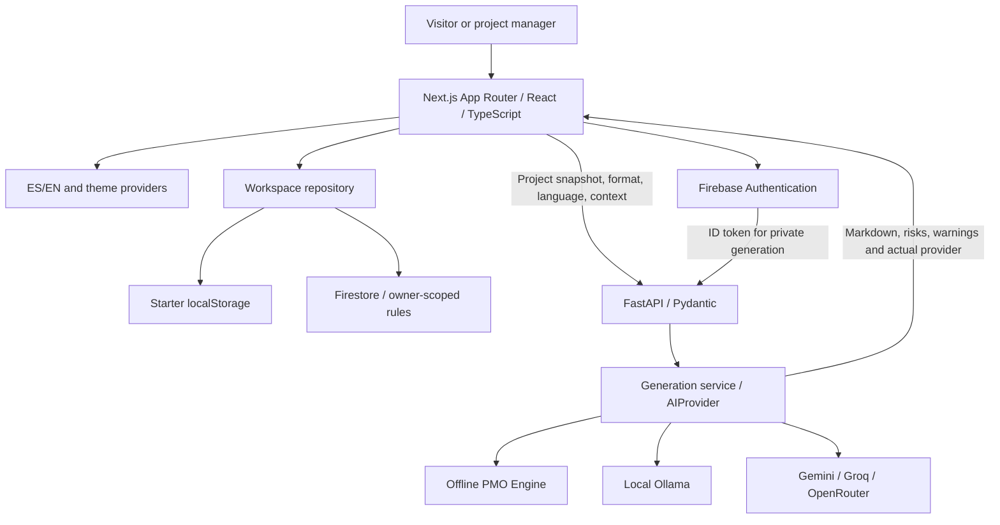
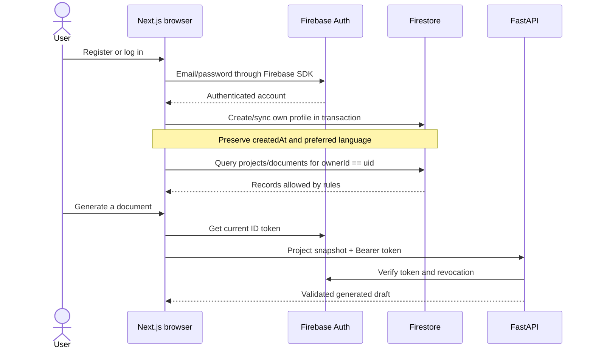

# Architecture

PMO Compass AI separates interaction, identity, storage and document generation. The same product workflow works with browser-local workspace data or a private Firebase account.

## System overview

## Frontend

`frontend/src/app` contains the public landing, login, start entry and workspace routes. The root layout loads shared fonts, theme initialisation and application providers. Private data is loaded in the browser with the authenticated SDK rather than rendered into Next.js server output.

Client components manage forms, locale, theme, authentication and the workspace. `WorkspaceProvider` refreshes data on entry, mutations, focus and storage events. `repository.ts` encapsulates project/document persistence; `api.ts` encapsulates generation transport and errors. Components do not choose an AI SDK or embed prompts.

The workspace shell provides auth-aware navigation, mobile navigation and loading/error states. A navigation guard improves UX; it is not the security boundary. ES/EN dictionaries have typed key parity, and document language is independent of interface language. Semantic tokens share light/dark surfaces between landing and private pages.

Markdown rendering skips raw HTML and external images. React Markdown sanitises link URLs; external links use `noopener noreferrer`. Provider output is displayed as document content, never executed.

## Backend

`backend/app/main.py` composes FastAPI, CORS, request-size/error handling and API routes. Pydantic validates the project snapshot, document type, language, context and fallback choice. `api/auth.py` verifies Firebase ID tokens when required. Routes apply process-local rate limits.

The backend is stateless with respect to project content. It does not query Firestore for projects or save generated documents. A caller supplies the snapshot; the response is a draft for review. Storage ownership is checked independently when the browser saves it.

| Endpoint | Responsibility |
| --- | --- |
| `GET /api/v1/health` | Report API status and configured provider/model, without contacting the model |
| `POST /api/v1/generate` | Authenticate when configured and use the selected provider |
| `POST /api/v1/demo/generate` | Public deterministic template generation |

Errors use stable codes and omit source notes/provider internals. The current rate limiter is per process; a production multi-instance service would need shared quotas and trusted proxy configuration.

## Firebase and data boundaries

Firebase Authentication manages email/password accounts. Cloud Firestore contains `users`, `projects` and `documents`; see [database schema](database-schema.md).

Cloud repository queries include `ownerId == uid`. Rules enforce ownership, immutable ownership/creation fields, valid document types, and an active owned project for document creation. Rules do not act as query filters. Documents are immutable after saving; identical retries are allowed.

The backend uses Firebase Admin solely for ID-token verification, including revocation checks. Server credentials remain outside browser code. Cloud access never silently falls back to localStorage after an error.

## Authentication flow

Start entry creates a browser-local identity and an empty workspace; fictional examples are optional. This is a playground, not an authentication scheme. A local session has no entitlement to cloud records. Entering the Starter Workspace from a cloud account leaves cloud data intact; an explicit login returns to the account. Logging out clears the active local marker and signs out Firebase when configured.

## Project and document data flow

1. Create a project. The repository validates it, attaches owner/timestamps and writes to the selected store.
2. Save notes explicitly. “Generate with AI” from project notes first saves pending edits, then opens the generator.
3. The generator loads the selected project's saved context. A collapsible source preview exposes the notes used for generation.
4. The browser sends only the project context fields, document type, language and extra context to FastAPI.
5. The selected provider returns a validated draft. The service assigns its ID, timestamp and actual provider.
6. The preview retains the project, type, language and context of that generation. Changing controls does not reattribute an existing output.
7. Copy and download use the displayed Markdown. Save writes the draft UUID to the current repository; identical retries are safe.
8. History reloads persisted documents and their provider/warnings. Generation itself never saves automatically.

## AIProvider architecture and generation flow

The asynchronous AIProvider contract is routed by service.py through Gemini → Groq → OpenRouter → OfflinePMOProvider. Explicit providers and Ollama also fall back offline on failure. The response records actual provider and warnings. PMOInferenceService adds source-aware risks, assumptions, missing information and qualitative health. Previous drafts are unverified references. See [AI strategy](ai-strategy.md).

Public visitors use `/workspace/generate`; signed-in users use authenticated `/generate`. Both use the configured router, bounded transport and usage quotas. Corresponding `/workspace/intelligence` and `/intelligence` endpoints run the explainable inference engine. Public generation never grants access to cloud records. Storage selection is independent of generation fallback.

## Starter lifecycle and seeding

`demo-projects.json` defines six bilingual project contexts. `npm run seed:starter` uses the actual offline provider to rebuild six documents per language into `demo-documents.json`. The script writes only that fixture file.

On first entry, the repository creates empty `pmo.workspace.v1.<demo-uid>` data. **Add starter projects** adds only absent stable project IDs and their fixture documents. It never replaces an existing project or document and is idempotent. An older four-project workspace can add the two new sectors without losing edits. Intentionally deleted documents under an existing project are not restored by this additive operation.

**Replace workspace with starter projects** is a separate destructive local operation with a confirmation dialog. Both repository operations reject Firebase identities before touching data. Neither inserts examples into Firestore.

## Deletion and retry behavior

Cloud project deletion marks `deleting: true`, blocking new documents under that project. It deletes owned children in batches of up to 400, then deletes the parent. A failed operation leaves the project visible for retry; it does not reverse the tombstone. Local deletion removes the project and its documents in one localStorage write.

Firestore has no automatic cascade. Rules allow owners to read/delete orphaned documents for cleanup. A future trusted background job should make deletion durable across devices and unusual manual data operations.

## Current tradeoffs

- Whole-workspace loading, client-side sorting/search and no pagination target a personal PMO workspace.
- localStorage has device scope, quotas and no concurrent-write transactions or protection from others using the same browser profile.
- Refresh on focus is not realtime collaboration; simultaneous edits can overwrite one another.
- ISO client timestamps simplify the two stores but are not trusted audit chronology.
- No live deployment, paid provider or model installation is required for the local workspace.
- Request cancellation stops waiting in the frontend; guaranteed cancellation inside the model is future work.

## Verification

pytest exercises contracts, generation and error behavior. Playwright exercises project CRUD, source notes, save/copy/export, reload, themes, responsive layouts, safe starter additions and provider fallback. Firebase emulators verify rules and real SDK workflows across separate accounts. axe covers supported automated WCAG A/AA checks on nine routes in both themes.

See [validation](VALIDATION.md) for executed checks and [roadmap](product-roadmap.md) for acceptance criteria beyond the MVP.
