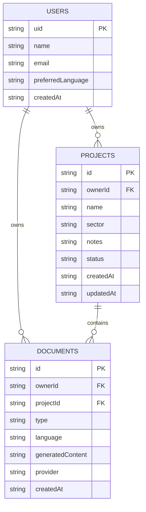

# Database schema

Firebase mode uses three top-level Cloud Firestore collections. Demo mode uses equivalent project/document objects inside one owner-specific localStorage record; it does not create a Firestore profile or collection.

The diagram is a logical relationship map, not a SQL schema. Firestore has no automatic joins, foreign-key cascades or requirement that a profile document exist before a project. Auth identity and security rules enforce ownership. Project/document IDs are path IDs, mapped onto frontend objects on read; they are not duplicated inside Firestore records.

## users/{uid}

Purpose: the signed-in user's display identity and language preference. The document ID matches the Firebase Auth UID.

| Field | Type | Purpose / constraints |
| --- | --- | --- |
| `uid` | string | Must equal the authenticated UID and document path |
| `name` | string | Display name; maximum 100 characters |
| `email` | string | Must match the email claim in the Auth token |
| `preferredLanguage` | `es` or `en` | Saved account interface preference |
| `createdAt` | ISO UTC string | Created by the client; immutable on update; maximum 40 characters |

Authentication credentials are managed by Firebase Auth. Passwords are never stored in this collection. Profile creation/synchronisation uses a transaction that preserves existing `createdAt` and `preferredLanguage`.

## projects/{projectId}

Purpose: an owned project's editable context, used as source input for generation.

| Field | Type | Purpose / constraints |
| --- | --- | --- |
| `ownerId` | string | Auth UID; immutable |
| `name` | string | Project title; 2–120 characters |
| `sector` | string | Free-text sector; 2–80 characters |
| `description` | string | Purpose and scope; up to 5,000 characters |
| `objectives` | string | Outcomes and success criteria; up to 5,000 characters |
| `startDate` | string | `YYYY-MM-DD` or empty |
| `endDate` | string | `YYYY-MM-DD` or empty; cannot precede start when both exist |
| `status` | enum | `planning`, `active`, `at_risk`, `completed` |
| `budget` | number or null | Optional EUR budget; 0–1,000,000,000,000 |
| `stakeholders` | string | Names and roles; up to 4,000 characters |
| `notes` | string | Updates, source evidence, risks, decisions and actions; up to 20,000 characters |
| `createdAt` | ISO UTC string | Immutable creation value; maximum 40 characters |
| `updatedAt` | ISO UTC string | Last client-side save; maximum 40 characters |
| `deleting` | optional boolean | Tombstone used during retryable cloud cascade deletion |

All fields except `deleting` are required in storage; optional text/date inputs use empty strings. Frontend controls and Pydantic check date validity; Firestore rules check the date string format and order. The backend request maps empty project dates to null.

Initial demo risks are part of `notes`. They are source observations, not an extra project schema field. The current product has no separately editable risk collection.

## documents/{documentId}

Purpose: preserve the exact reviewed generation, its language/context and provider metadata. A generation UUID becomes the saved document path.

| Field | Type | Purpose / constraints |
| --- | --- | --- |
| `ownerId` | string | Must belong to the authenticated user |
| `projectId` | string | Active owned project required when creating; up to 128 characters |
| `type` | enum | One of the eight document types below |
| `language` | `es` or `en` | Language requested for this generation |
| `inputContext` | string | Additional context captured for this generation; up to 12,000 characters |
| `generatedContent` | string | Saved Markdown; non-empty, up to 100,000 characters |
| `createdAt` | ISO UTC string | Generation timestamp; maximum 40 characters |
| `provider` | enum | Actual `demo`, `ollama` or `external` provider |
| `risks` | array | Up to 30 structured risk signals |
| `warnings` | string array | Up to 20 generation/review notes, including fallback provenance |

Document types: `executive_brief`, `weekly_status`, `risk_register`, `meeting_minutes`, `action_items`, `stakeholder_email`, `scope_change`, `lessons_learned`.

Each generated risk has nine non-empty string fields: `risk`, `evidence`, `cause`, `impact`, `probability`, `severity`, `mitigation`, `signal`, `suggestedOwner`. Pydantic bounds each risk field and warning to 2,000 characters. Firestore rules validate the outer record and array sizes, but do not deeply validate every risk object; model-output validation is not a claim that records manually written by their owner are model-verified.

`fallbackFrom` is API response metadata. Its meaning is retained in the saved warning; it is not an additional Firestore field. The UI-only preview `projectName` is not persisted. Original project notes are not versioned inside each saved record; embedded source quotes and `inputContext` provide partial provenance, not a complete historical snapshot.

## Ownership and persistence invariants

- Users can read/write only their own profile.
- Project/document list queries include `ownerId == uid`; Firestore rules independently enforce access.
- Project ownership and creation time cannot change.
- New documents require an existing, owned project without a deletion tombstone.
- Saved documents are immutable. Updates are allowed only when the full record is identical, enabling retry after an uncertain save.
- Owners can read/delete their own orphan documents for cleanup.
- Unrecognised collections and fields are rejected by the supplied rules.

These are enforced by [firestore.rules](../firebase/firestore.rules) and exercised by emulator tests. A frontend auth guard alone does not provide these guarantees.

## Deletion

There is no built-in Firestore cascade. The repository marks a project `deleting`, deletes child documents in batches of up to 400, then deletes the project. Failed deletion remains visible for retry. Rules prevent new documents under a marked project.

In demo mode, removing a project removes its documents in the same localStorage write. **Load missing examples** only recreates absent example projects and their fixtures, preserving all existing records. **Reset demo data** replaces the local demo after explicit confirmation; both helpers reject cloud identities.

## Indexes and scale

Current reads are single-field owner queries. Sorting, filtering and search happen in the client after loading the whole workspace. [firestore.indexes.json](../firebase/firestore.indexes.json) accompanies the rules; future server-side filters, pagination and ordering may need additional compound indexes.

Client ISO timestamps keep local and cloud adapters aligned but do not establish trusted audit chronology. Server timestamps, version history, risk lifecycle records, team membership and organisation IDs are future schema work, with migrations and rule tests required. See [roadmap](product-roadmap.md).
